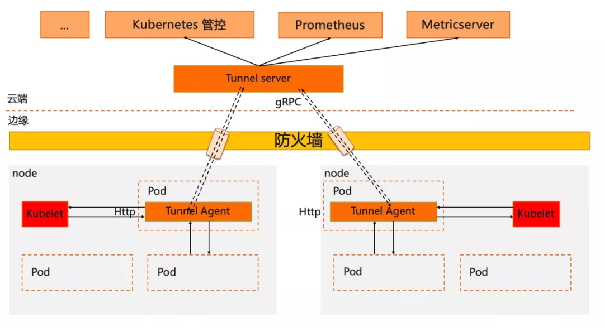
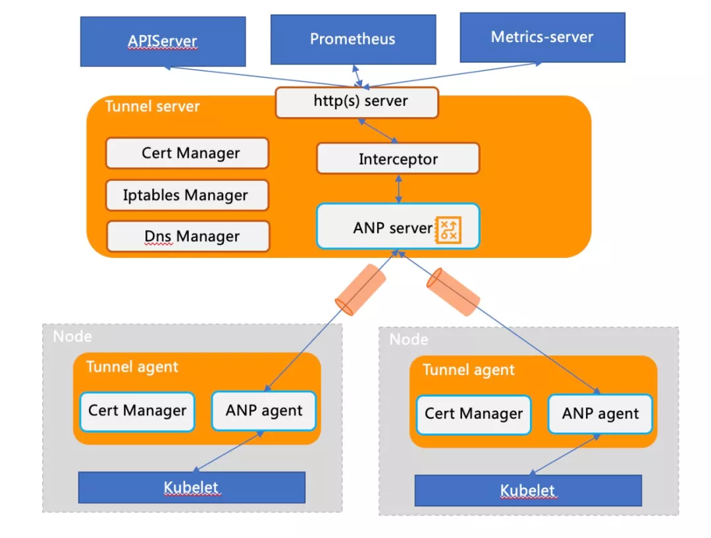
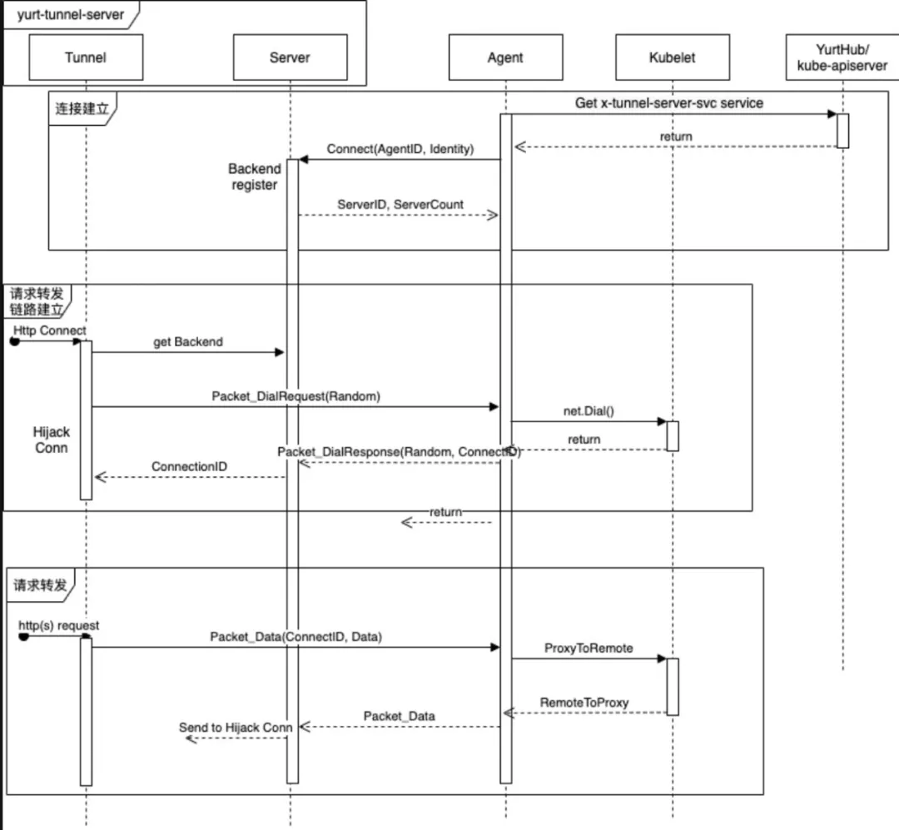

# Yurt-Tunnel｜如何解决 K8s 在云边协同下的运维监控挑战

2021-07-12 **阿里巴巴云原生**


## 背景

伴随着 5G、IoT 等技术的快速发展，边缘计算被越来越广泛地应用于电信、媒体、运输、物流、农业、零售等行业和场景中，成为解决这些领域数据传输效率的关键方式。与此同时，边缘计算形态、规模、复杂度的日益增长，边缘计算领域的运维手段、运维能力对边缘业务创新速度的支撑日趋乏力。于是，Kubernetes 迅速成为边缘计算的关键要素，帮助企业在边缘更好地运行容器，最大化利用资源、缩短研发周期。

但是，如果将原生 Kubernetes 直接应用到边缘计算场景下，仍然需要解决诸多问题，比如云与边一般位于不同网络平面，同时边缘节点普遍位于防火墙内部，采用云(中心)边协同架构，将导致原生 K8s 系统的运维监控能力面临如下挑战：

- K8s 原生运维能力缺失(如 kubectl logs/exec 等无法执行)
- 社区主流监控运维组件无法工作(如 Prometheus/metrics-server )

为了帮助企业解决原生 Kubernetes 在边缘场景下关于应用生命周期管理、云边网络连接、云边端运维协同、异构资源支持等方方面面的挑战，基于 K8s 实现的边缘计算云原生开源平台 OpenYurt 应运而生，其也是 CNCF 在边缘云原生版图中的重要组成部分。本文将详细介绍，作为 OpenYurt 核心组件之一的 Yurt-Tunnel 如何是扩展原生 K8s 系统在边缘场景下相关能力的。

## Yurt-Tunnel设计思路
由于边缘可以访问云端，因此可以考虑在云边构建可以反向穿透的隧道，从而保证云(中心)可以基于隧道主动访问边缘。当时我们也调查了很多开源的隧道方案，从能力以及生态兼容性等方面，最后我们选择基于 [ANP](https://github.com/kubernetes-sigs/apiserver-network-proxy) 设计并实现了 Yurt-Tunnel 整体解决方案，具备安全，非侵入、可扩展、传输高效等优点。



## 实现方式
在 K8s 云边一体化架构中构建一个安全、非侵入、可扩展的反向通道解决方案，方案中至少需要包括如下能力。

- 云边隧道构建
- 隧道两端证书的自管理
- 云端组件请求被无缝倒流到隧道

Yurt-Tunnel 的架构模块如下图：


###  云边隧道构建

当边缘的 yurt-tunnel-agent 启动时，会根据访问地址与 yurt-tunnel-server 建立连接并注册，并周期性检测连接的健康状态以及重建连接等。

``` 
# https://github.com/openyurtio/apiserver-network-proxy/blob/master/pkg/agent/client.go#L189
# yurt-tunnel-agent的注册信息:
"agentID": {nodeName}
"agentIdentifiers": ipv4={nodeIP}&host={nodeName}"
```

当 yurt-tunnel-server 收到云端组件的请求时，需要把请求转发给对应的 yurt-tunnel-agent 。因为除了转发初始请求之外，该请求 session 后续还有数据返回或者数据的持续转发(如 kubectl exec )。因此需要双向转发数据。同时需要支持并发转发云端组件的请求，意味需要为每个请求生命周期建立一个独立的标识。所以设计上一般会有两种方案。

- 方案 1:  初始云边连接仅通知转发请求，tunnel-agent 会和云端建立新连接来处理这个请求。通过新连接可以很好的解决请求独立标识的问题，同时并发也可以很好的解决。但是为每个请求都需要建立一个连接，将消耗大量的资源。

- 方案 2: 仅利用初始云边连接来转发请求，大量请求为了复用同一条连接，所以需要为每个请求进行封装，并增加独立标识，从而解决并发转发的诉求。同时由于需要复用一条连接，所以需要解耦连接管理和请求生命周期管理，即需要对请求转发的状态迁移进行独立管理。该方案涉及到封包解包，请求处理状态机等，方案会复杂一些。

OpenYurt 选择的 ANP 组件，采用的是上述方案2，这个和我们的设计初衷也是一致的。

``` 
# https://github.com/openyurtio/apiserver-network-proxy/blob/master/konnectivity-client/proto/client/client.pb.go#L98
# 云边通信的数据格式以及数据类型
type Packet struct {
  Type PacketType `protobuf:"varint,1,opt,name=type,proto3,enum=PacketType" json:"type,omitempty"`
  // Types that are valid to be assigned to Payload:
  //  *Packet_DialRequest
  //  *Packet_DialResponse
  //  *Packet_Data
  //  *Packet_CloseRequest
  //  *Packet_CloseResponse
  Payload              isPacket_Payload `protobuf_oneof:"payload"`
}
```

请求转发链路构建封装在 Packet_DialRequest 和 Packet_DialResponse 中，其中 Packet_DialResponse.ConnectID 用于标识 request ，相当于 tunnel 中的 requestID。请求以及关联数据封装在 Packet_Data 中。Packet_CloseRequest 和 Packet_CloseResponse 用于转发链路资源回收。具体可以参照下列时序图：



RequestInterceptor 模块的作用

从上述分析可以看出，yurt-tunnel-server 转发请求之前，需要请求端先发起一个Http Connect 请求来构建转发链路。但是为 Prometheus、metrics-server 等开源组件增加相应处理会比较困难，因此在 Yurt-tunnel-server 中增加请求劫持模块 Interceptor ，用来发起 Http Connect 请求。相关代码如下:
``` 
# https://github.com/openyurtio/openyurt/blob/master/pkg/yurttunnel/server/interceptor.go#L58-82
    proxyConn, err := net.Dial("unix", udsSockFile)
    if err != nil {
      return nil, fmt.Errorf("dialing proxy %q failed: %v", udsSockFile, err)
    }

    var connectHeaders string
    for _, h := range supportedHeaders {
      if v := header.Get(h); len(v) != 0 {
        connectHeaders = fmt.Sprintf("%s\r\n%s: %s", connectHeaders, h, v)
      }
    }

    fmt.Fprintf(proxyConn, "CONNECT %s HTTP/1.1\r\nHost: %s%s\r\n\r\n", addr, "127.0.0.1", connectHeaders)
    br := bufio.NewReader(proxyConn)
    res, err := http.ReadResponse(br, nil)
    if err != nil {
      proxyConn.Close()
      return nil, fmt.Errorf("reading HTTP response from CONNECT to %s via proxy %s failed: %v", addr, udsSockFile, err)
    }
    if res.StatusCode != 200 {
      proxyConn.Close()
      return nil, fmt.Errorf("proxy error from %s while dialing %s, code %d: %v", udsSockFile, addr, res.StatusCode, res.Status)
    }
```


### 证书管理

为了保证云边通道的长期安全通信，同时也为了支持 https 请求转发，yurt-tunnel 需要自行生成证书并且保持证书的自动轮替。具体实现如下:
``` 
# 1. yurt-tunnel-server证书:
# https://github.com/openyurtio/openyurt/blob/master/pkg/yurttunnel/pki/certmanager/certmanager.go#L45-90
- 证书存储位置: /var/lib/yurt-tunnel-server/pki
- CommonName: "kube-apiserver-kubelet-client"  // 用于kubelet server的webhook校验
- Organization: {"system:masters", "openyurt:yurttunnel"} // 用于kubelet server的webhook校验和yurt-tunnel-server证书的auto approve
- Subject Alternate Name values: {x-tunnel-server-svc, x-tunnel-server-internal-svc的ips和dns names}
- KeyUsage: "any"

# 2. yurt-tunnel-agent证书：
# https://github.com/openyurtio/openyurt/blob/master/pkg/yurttunnel/pki/certmanager/certmanager.go#L94-112
- 证书存储位置: /var/lib/yurt-tunnel-agent/pki
- CommonName: "yurttunnel-agent"
- Organization: {"openyurt:yurttunnel"} // 用于yurt-tunnel-agent证书的auto approve
- Subject Alternate Name values: {nodeName, nodeIP}
- KeyUsage: "any"

# 3. yurt-tunnel证书申请(CSR)均由yurt-tunnel-server来approve
# https://github.com/openyurtio/openyurt/blob/master/pkg/yurttunnel/pki/certmanager/csrapprover.go#L115
- 监听csr资源
- 过滤非yurt-tunnel的csr(Organization中没有"openyurt:yurttunnel")
- approve还未Approved的csr

# 4. 证书自动轮替处理
# https://github.com/kubernetes/kubernetes/blob/master/staging/src/k8s.io/client-go/util/certificate/certificate_manager.go#L224
```


### 无缝导流云端组件请求到隧道

因为需要无缝把云端组件的请求转发到 yurt-tunnel-server ，也意味不需要对云端组件进行任何修改。因此需要对云端组件的请求进行分析，目前组件的运维请求主要有以下两种类型:

- 类型1: 直接使用 IP 地址访问，如: http://{nodeIP}:{port}/{path}
- 类型2: 使用域名访问, 如: http://{nodeName}:{port}/{path}

针对不同类型请求的导流，需要采用不同方案。

- 方案1: 使用 iptables dnat rules 来保证类型1的请求无缝转发到 yurt-tunnel-server
``` 
# 相关iptables rules维护代码: https://github.com/openyurtio/openyurt/blob/master/pkg/yurttunnel/iptables/iptables.go
# yurt-tunnel-server维护的iptables dnat rules如下:
[root@xxx /]# iptables -nv -t nat -L OUTPUT
TUNNEL-PORT  tcp  --  *      *       0.0.0.0/0            0.0.0.0/0            /* edge tunnel server port */

[root@xxx /]# iptables -nv -t nat -L TUNNEL-PORT
TUNNEL-PORT-10255  tcp  --  *      *       0.0.0.0/0            0.0.0.0/0            tcp dpt:10255 /* jump to port 10255 */
TUNNEL-PORT-10250  tcp  --  *      *       0.0.0.0/0            0.0.0.0/0            tcp dpt:10250 /* jump to port 10250 */

[root@xxx /]# iptables -nv -t nat -L TUNNEL-PORT-10255
RETURN     tcp  --  *      *       0.0.0.0/0            127.0.0.1            /* return request to access node directly */ tcp dpt:10255
RETURN     tcp  --  *      *       0.0.0.0/0            172.16.6.156         /* return request to access node directly */ tcp dpt:10255
DNAT       tcp  --  *      *       0.0.0.0/0            0.0.0.0/0            /* dnat to tunnel for access node */ tcp dpt:10255 to:172.16.6.156:10264
```

- 方案2: 使用 dns 域名解析 nodeName 为 yurt-tunnel-server 的访问地址，从而使类型 2 请求无缝转发到 yurt-tunnel


``` 
# x-tunnel-server-svc和x-tunnel-server-internal-svc的不同用途:
 - x-tunnel-server-svc: 主要expose 10262/10263端口，用于从公网访问yurt-tunnel-server。如yurt-tunnel-agent
 - x-tunnel-server-internal-svc: 主要用于云端组件从内部网络访问，如prometheus,metrics-server等

# dns域名解析原理:
1. yurt-tunnel-server向kube-apiserver创建或更新yurt-tunnel-nodes configmap, 其中tunnel-nodes字段格式为: {x-tunnel-server-internal-svc clusterIP}  {nodeName}，确保记录了所有nodeName和yurt-tunnel-server的service的映射关系
2. coredns pod中挂载yurt-tunnel-nodes configmap，同时使用host插件使用configmap的dns records
3. 同时在x-tunnel-server-internal-svc中配置端口映射，10250映射到10263，10255映射到10264
4. 通过上述的配置，可以实现http://{nodeName}:{port}/{path}请求无缝转发到yurt-tunnel-servers
```
云端请求扩展:

如果用户需要访问边缘的其他端口(10250 和 10255 之外)，那么需要在 iptables 中增加相应的 dnat rules 或者 x-tunnel-server-internal-svc 中增加相应的端口映射，如下所示:

``` 
# 例如需要访问边缘的9051端口
# 新增iptables dnat rule:
[root@xxx /]# iptables -nv -t nat -L TUNNEL-PORT
TUNNEL-PORT-9051  tcp  --  *      *       0.0.0.0/0            0.0.0.0/0            tcp dpt:9051 /* jump to port 9051 */

[root@xxx /]# iptables -nv -t nat -L TUNNEL-PORT-9051
RETURN     tcp  --  *      *       0.0.0.0/0            127.0.0.1            /* return request to access node directly */ tcp dpt:9051
RETURN     tcp  --  *      *       0.0.0.0/0            172.16.6.156         /* return request to access node directly */ tcp dpt:9051
DNAT       tcp  --  *      *       0.0.0.0/0            0.0.0.0/0            /* dnat to tunnel for access node */ tcp dpt:9051 to:172.16.6.156:10264

# x-tunnel-server-internal-svc中新增端口映射
spec:
  ports:
  - name: https
    port: 10250
    protocol: TCP
    targetPort: 10263
  - name: http
    port: 10255
    protocol: TCP
    targetPort: 10264
  - name: dnat-9051 # 新增映射
    port: 9051
    protocol: TCP
    targetPort: 10264
```

当然上述的 iptables dnat rules 和 service 端口映射，都是由 yurt-tunnel-server 自动更新。用户只需要在 yurt-tunnel-server-cfg configmap 中增加端口配置即可。具体如下:

``` 
# 注意：由于证书不可控因素，目前新增端口只支持从yurt-tunnel-server的10264转发
apiVersion: v1
data:
  dnat-ports-pair: 9051=10264 # 新增端口=10264(非10264转发不支持)
kind: ConfigMap
metadata:
  name: yurt-tunnel-server-cfg
  namespace: kube-system
```

## 近期规划

- 支持 kube-apiserver 的 EgressSelector 功能
- 验证 yurt-tunnel-server 多实例部署验证
- 支持 yurt-tunnel-agent 配置多个 yurt-tunnel-server 地址
- 支持证书存储目录自定义
- 支持证书 Usage 定义更精细化，保证证书使用范围可控
- 支持 yurt-tunnel-server 访问地址变化后，yurt-tunnel-server 证书可自动更新
- 支持 yurt-tunnel-agent 对 yurt-tunnel-server 访问地址的自动刷新
- 支持非 NodeIP/NodeName 类型的请求转发(如非主机网络 Pod 的云访问边)
- 支持通过 Tunnel 由边缘 Pod 访问云端 Pod
- 支持 yurt-tunnel 的独立部署(非绑定 k8s )
- 支持更多协议转发，如 gRPC, websocket, ssh 等


## 欢迎加入OpenYurt社区
作为阿里云边缘容器服务 ACK@Edge 的内核，OpenYurt 已经在 CDN、音视频直播、物联网、物流、工业大脑、城市大脑等数十个行业中得到商业化实践、服务规模达数百万 CPU 核。我们可喜地看到，现在有越来越多的开发者、开源社区、企业和学信机构认可 OpenYurt 的理念，并且正在加入到共同建设 OpenYurt 的队伍中，比如 VMware、Intel、深信服、招商局、浙大、EdgeX Foundry 社区、eKuiper 社区等。我们也欢迎更多的朋友共建 OpenYurt 社区，繁荣云原生边缘计算生态，让真正意义上的云原生在更多边缘场景中创造价值。


[原文链接](https://mp.weixin.qq.com/s/QVrygAyq01AWbvgj1ihBEQ)


