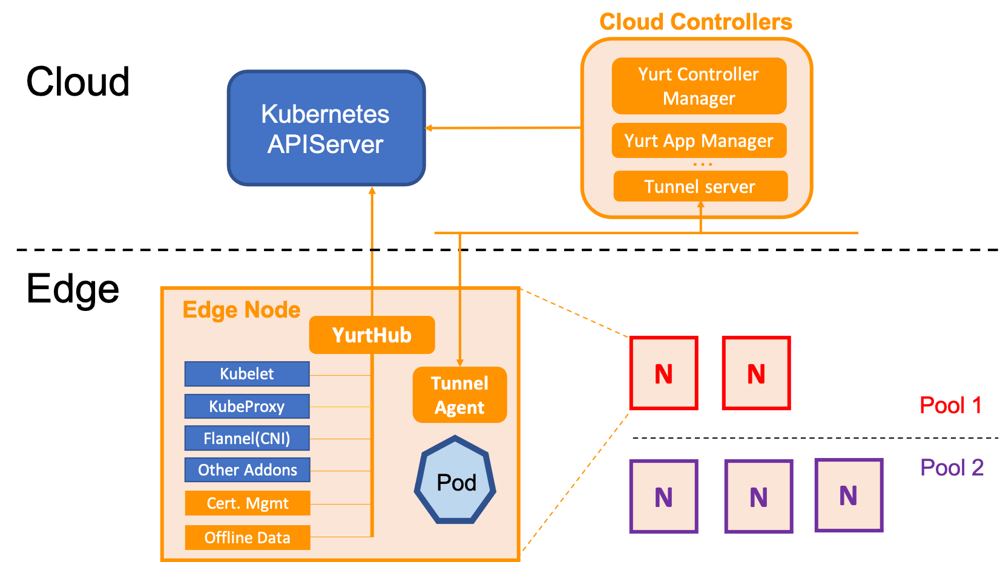
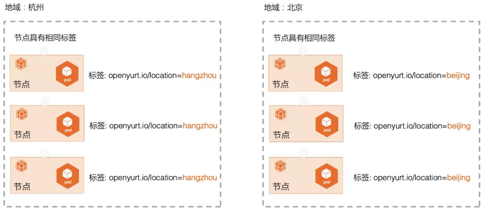
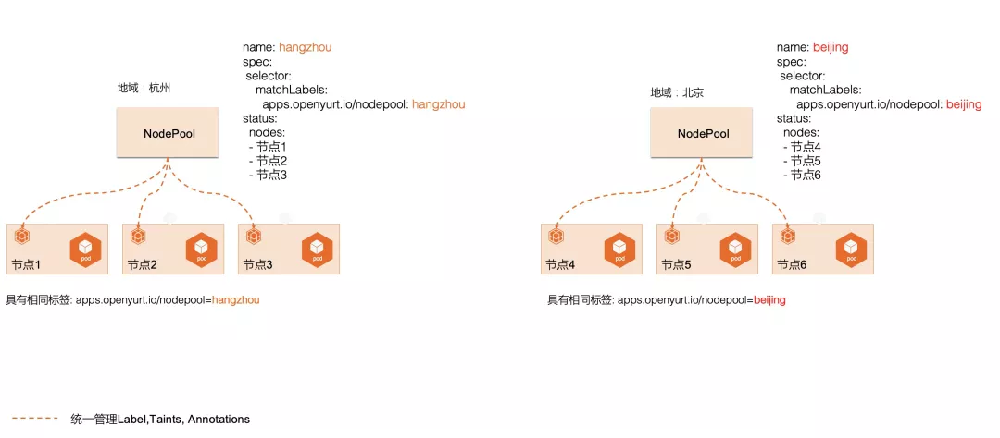
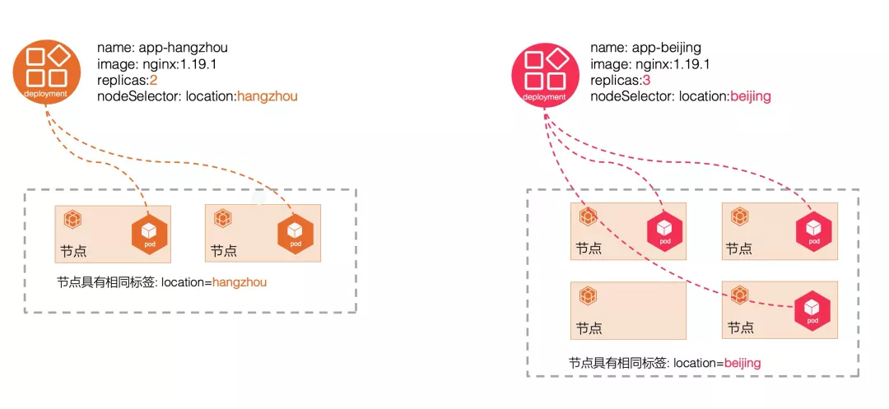
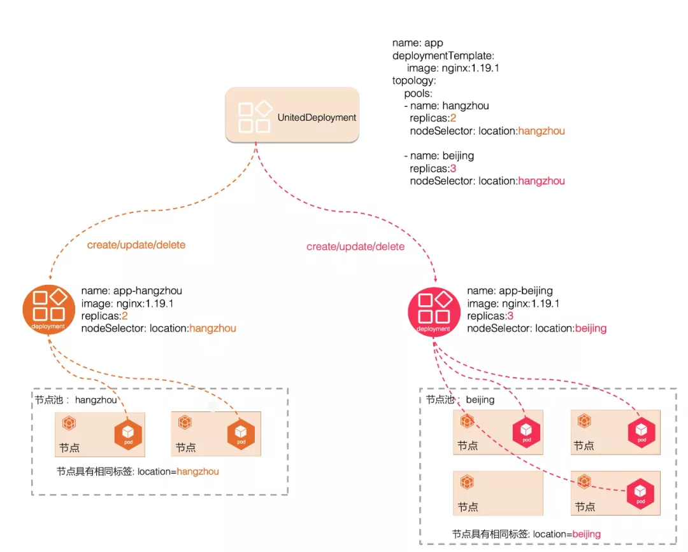

# OpenYurt v0.3.0 重磅发布：全面提升边缘场景下应用部署效率
2021-01-13 **阿里巴巴云原生**

##简介
OpenYurt 是由阿里云开源的基于原生 Kubernetes 构建的、业内首个对于 Kubernetes 非侵入式的边缘计算项目，目标是扩展 Kubernetes 以无缝支持边缘计算场景。它提供了完整的 Kubernetes API 兼容性；支持所有 Kubernetes 工作负载、服务、运营商、CNI 插件和 CSI 插件；提供良好的节点自治能力，即使边缘节点与云端断网，在边缘节点中运行的应用程序也不会受影响。OpenYurt 可以轻松部署在任何 Kubernetes 集群服务中，让强大的云原生能力扩展到边缘。

## OpenYurt v0.3.0 重磅发布

北京时间 2021 年 11 月 8 号，Openyurt 发布 v0.3.0 版本，首次提出节点池和单元化部署概念，新增云端 Yurt-App-Manager 组件，全面提升在边缘场景下的应用部署效率，降低边缘节点和应用运维的复杂度。全面优化 yurthub、yurt-tunnel 核心组件的性能，yurtctl 提供 kubeadm 的 provider，可以快速方便地将由 kubeadm 创建的 Kubernetes 集群转换成 Openyurt 集群。

### 1.Yurt-App-Manger 为边缘应用运维而生
经过与社区同学的广泛讨论，OpenYurt 提供 OpenYurt Yurt-App-Manager 组件。Yurt-App-Manager 是 Kubernetes 的一个标准扩展，它可以配合 Kubernetes 使用，提供 NodePool 和 UnitedDeployment 两种控制器，从主机维度和应用维度来提供边缘场景下节点和应用的运维能力。

#### 节点池：NodePool

在边缘场景下，边缘节点通常具备很强的区域性、地域性、或者其他逻辑上的分组特性（比如相同 CPU 架构、同一个运营商、云提供商），不同分组的节点间往往存在网络不互通、资源不共享、资源异构、应用独立等明显的隔离属性，这也是 NodePool 的由来。

NodePool 顾名思义，我们可以称之为节点池、节点组或者节点单元。而对具备共同属性的 woker node 进行管理，传统的做法是用 Label 的方式来对主机进行分类管理，但是随着节点和 Label 数量的增加，对节点主机分类运维（例如：批量设置调度策略、taints 等）效率和灵活性会越来越差，如下图所示:

NodePool 以节点组的维度对节点划分做了更高维度的抽象，可以从节点池视角对不同边缘区域下的主机进行统一管理和运维，如下图所示：

#### 单元化部署：UnitedDeployment
在边缘场景下，相同的应用可能需要部署在不同地域下的计算节点上，以 Deployment 为例，传统的做法是先将相同地域的计算节点设置相同的 Label，然后创建多个 Deployment，每个 Deployment 通过 nodeSelectors 选定不同的 Label，依次来达到相同的应用部署到不同地域的需求。但是这些代表相同应用的多个 Deployment，除了 name、nodeselectors、replicas 这些特性外，其他的差异化配置非常小。如下图所示：

但是随着地域分布越来越多，以及不同地域对应用的差异化需求，使得运维变得越来越复杂，具体表现在以下几个方面：

- 镜像版本升级，需要将每个 Deployment 逐一修改。
- 需要自定义 Deployment 的命名规范，以此来表明相同的应用。
- 随着边缘场景越来越复杂，需求增多，每个节点池的 Deployment 会有一些差异化的配置，不好管理。

单元化部署（UnitedDeployment）通过更上层次的抽象，对这些子的 Deployment 进行统一管理: 自动创建/更新/删除。如下图所示：

UnitedDeployment 控制器可以提供一个模板来定义应用，并通过管理多个 workload 来匹配下面不同的区域。每个 UnitedDeployment 下每个区域的 workload 被称为 pool， 目前 pool 支持使用两种 workload：StatefulSet 和 Deployment。控制器会根据 UnitedDeployment 中 pool 的配置创建子的 workload 资源对象，每个资源对象都有一个期望的 replicas Pod 数量。通过一个 UnitedDeployment 实例就可以自动维护多个 Deployment 或者 Statefulset 资源，同时还能具备 replicas 等的差异化配置。如若获取更直观的操作体验，请查看 Yurt-App-Manager [使用教程](https://github.com/openyurtio/openyurt/blob/master/docs/tutorial/yurt-app-manager.md) 和[开发者教程](https://github.com/openyurtio/openyurt/blob/master/docs/tutorial/yurt-app-manager-dev.md) 。
更多关于 Yurt-App-Manager 的讨论请参考社区 issue 和 pull request：

### 2.节点自治组件 yurt-hub

yurt-hub 是运行在 Kubernetes 集群中每个节点上运行的守护程序，它的作用是作为（Kubelet、Kubeproxy、CNI 插件等）的出站流量的代理。它在边缘节点的本地存储中缓存 Kubernetes 节点守护进程可能访问的所有资源的状态。如果边缘节点离线，则这些守护程序可以帮助节点在重新启动后恢复状态，达到边缘自治的能力。在 v0.3.0 版本中，社区对 yurt-hub 做了大量的功能性增强，主要包括：

- yurt-hub 链接云端 kube-apiserver 时，自动向 kube-apiserver 申请证书，并支持证书过期自动轮转。

- 在 watch 云端资源时，增加超时机制。

- 当本地缓存数据不存在时候，优化 response。

### 3.云边运维通道组件 yurt-tunnel

yurt-tunnel 包括云端的 TunnelServer 和每个边缘节点上运行的 TunnelAgent 组成。TunnelServer 通过反向代理与在每个边缘节点中运行的 TunnelAgent 守护进程建立连接，并以此在公共云的控制平面与处于企业内网环境的边缘节点之间建立安全的网络访问。在 v0.3.0 版本中，社区对 yurt-tunnel 组件，在可靠性、稳定性、集成测试方面都做了大量的增强。

### 4.OpenYurt 运维组件 yurtctl

在 v0.3.0 版本中，yurtctl 支持 kubeadm provider，可以快速方便地将由 kubeadm 创建的原生 Kubernetes 集群转换成能够适应边缘弱网环境的 Kubernetes 集群, 极大提升 OpenYurt 的使用体验。

## 未来计划
OpenYurt V0.3.0 版本发布，进一步提升了原生 Kubernetes 在边缘场景的扩展能力，同时在针对边缘场景下的应用部署的问题发布了 Yurt-App-Manger 组件，后续 OpenYurt 社区会在设备管理、边缘运维调度、社区治理和贡献者体验方面持续投入，再次感谢 Intel/Vmware 的同学参与，同时也非常欢迎有兴趣的同学加入参与共建，共同打造一个稳定，可靠的完全云原生的边缘计算平台。