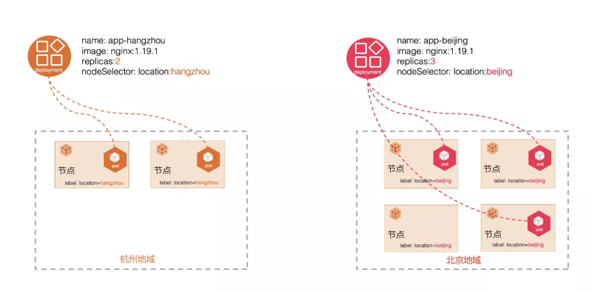
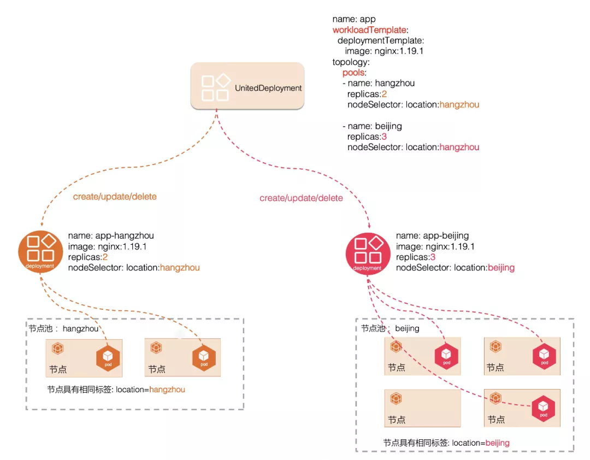

# OpenYurt 单元化部署新增 Patch 特性
2021-05-06 **阿里巴巴云原生**


## 背景

在正文开始之前，我们先回顾一下单元化部署的概念和设计理念。在边缘计算场景下，计算节点具有很明显的地域分布属性，相同的应用可能需要部署在不同地域下的计算节点上。以 Deployment 为例，如下图所示，传统的做法是先将相同地域的计算节点设置成相同的标签，然后创建多个 Deployment，不同 Deployment 通过 NodeSelectors 选定不同的标签，从而实现将相同的应用部署到不同地域的需求。



但是随着地域分布越来越多，使得运维变得越来越复杂，具体表现在以下几个方面：

- 当镜像版本升级，需要修改大量相关的 Deployment 的镜像版本配置。

- 需要自定义 Deployment 的命名规范来表明相同的应用。

- 缺少一个更高的视角对这些 Deployment 进行统一管理和运维。运维的复杂性随着应用和地域分布增多出现线性增长。


基于以上需求和问题，openyurt 的 yurt-app-manager 组件提供的单元化部署（UnitedDeployment）通过更上层次的抽象，对这些子的 Deployment 进行统一管理：自动创建/更新/删除，从而大幅简化了运维复杂度的问题。

[yurt-app-manager组件](https://github.com/openyurtio/yurt-app-manager)
如下图所示：


单元化部署（UnitedDeployment）对这些 Workload 进行了更高层次的抽象，UnitedDeployment 包含两个主要配置：WorkloadTemplate 和 Pools。workloadTemplate 格式可以是 Deployment 也可以是 Statefulset。Pools 是一个列表，每个列表都有一个 Pool 的配置，每个 Pool 都有它的 name、replicas 和 nodeSelector 配置。通过 nodeSelector 可以选择一组机器， 因此在边缘场景下 Pool 我们可以简单的认为它代表了某个地域下的一组机器。使用 WorkloadTemplate + Pools 的定义，我们可以很容易的将一个 Deployment 或者 Statefulset 应用分发到不同的地域中去。


下面是一个具体的 UnitedDeployment 例子：

``` 
apiVersion: apps.openyurt.io/v1alpha1
kind: UnitedDeployment
metadata:
  name: test
  namespace: default
spec:
  selector:
    matchLabels:
      app: test
  workloadTemplate:
    deploymentTemplate:
      metadata:
        labels:
          app: test
      spec:
        selector:
          matchLabels:
            app: test
        template:
          metadata:
            labels:
              app: test
          spec:
            containers:
            - image: nginx:1.18.0
              imagePullPolicy: Always
              name: nginx
  topology:
    pools:
    - name: beijing
      nodeSelectorTerm:
        matchExpressions:
        - key: apps.openyurt.io/nodepool
          operator: In
          values:
          - beijing
      replicas: 1
    - name: hangzhou
      nodeSelectorTerm:
        matchExpressions:
        - key: apps.openyurt.io/nodepool
          operator: In
          values:
          - hangzhou
      replicas: 2
```

UnitedDeployment 控制器的具体逻辑如下：

用户定义了一个 UnitedDeployment CR , CR 里定义了一个 DeploymentTemplate 和两个 Pool。

- 其中 DeploymentTemplate 格式为一个 Deployment 格式定义，本例子中使用的 Image 为 nginx:1.18.0。

- Pool1 的 name 为 beijing, replicas=1，nodeSelector 为 apps.openyurt.io/nodepool=beijing。代表 UnitedDeployment 控制器将要创建一个子的 Deployment，replicas 为 1，nodeSelector 为 apps.openyurt.io/nodepool=beijing，其他的配置继承自 DeploymentTemplate 配置。

- Pool2 的 name 为 hangzhou,replicas=2, nodeSelector 为 apps.openyurt.io/nodepool=hangzhou，代表 UnitedDeployment 控制器将要创建一个子的 Deployment，replicas 为 2，nodeSelector 为 apps.openyurt.io/nodepool=hangzhou，其他的配置继承自 DeploymentTemplate 配置。


UnitedDeployment 控制器检测到 name 为 test 的 UnitedDeployment CR 实例被创建后，会首先根据 DeploymentTemplate 里的配置生成一个 Deployment 的模板对象，根据 Pool1 和 Pool2 的配置和 Deployment 的模板对象，分别生成 name 前缀为 test-hangzhou- 和 test-beijing- 的两个 deployment 资源对象，这两个 Deployment 资源对象有自己的 nodeselector 和 replica 配置。这样通过使用 workloadTemplate+Pools 的形式，可以将 workload 分发到不同的地域，而无需用户维护大量的 Deployment 资源。

### UnitedDeployment 所解决的问题


UnitedDeployment 通过一个单元化部署实例就可以自动维护多个 Deployment 或者 Statefulset 资源，每个 Deployment 或者 Statefulset 资源都遵循统一的命名规范。同时还能实现 Name、NodeSelectors 和 Replicas 等的差异化配置。能极大地简化用户在边缘场景下的运维复杂度。


## 新的需求
UnitedDeployment 能满足用户的大部分需求，但是在我们进行推广和客户落地以及在与社区同学讨论的过程中，逐渐发现在一些特殊场景下，UnitedDeployment 提供的功能还显得有点不足，例如如下场景：

- 应用镜像升级时候，用户计划先在在某个节点池中做验证，如果验证成功，再在所有节点池中全量更新发布。

- 为了加快镜像拉取速度，用户可能在不同节点池中搭建自己的私有镜像仓库，因此同一个应用在每个节点池下的镜像名会不一样。

- 不同的节点池下服务器数量，规格，以及业务访问压力不一致，因此同一个应用在不同节点池下 pod 的 cpu，内存等配置会不一样。

- 同一个应用在不同节点池下可能会使用不同的 configmap 资源。


这些需求促使了 UnitedDeployment 需要提供针对每个 Pool 做一些个性化配置的功能，允许用户根据不同节点池下的实际情况做一些个性化的配置，比如镜像、pod 的 request 和 limit 等等。为了最大化的提供灵活性，经过讨论我们决定在 Pool 里增加 Patch 的字段，允许用户自定义 Patch 内容，但是需要遵循 Kubernetes 的 strategic merge patch 规范，其行为与我们常用的 kubectl patch 有点类似。

pool 里新增 patch，示例如下：


``` 

    pools:
    - name: beijing
      nodeSelectorTerm:
        matchExpressions:
        - key: apps.openyurt.io/nodepool
          operator: In
          values:
          - beijing
      replicas: 1          
      patch:
        spec:
          template:
            spec:
              containers:
              - image: nginx:1.19.3
                name: nginx
```

patch 里定义的内容，需要遵循 Kubernetes 的 strategic merge patch 规范， 如果用过 kubectl patch 的同学就很容易的知道 patch 内容如何书写，具体可以参照使用 kubectl patch 更新 Kubernetest api 对象。

接下来我们演示一下 UnitedDeployment patch 的使用。

##特性演示


###1. 环境准备


- 提供一个 K8s 集群或者 OpenYurt 集群，集群里至少 2 台节点。一台节点 label 为：apps.openyurt.io/nodepool=beiing, 另一台节点 label 为：apps.openyurt.io/nodepool=hangzhou。

- 集群里需要安装 yurt-app-manager 组件。

[yurt-app-manager 组件](https://github.com/openyurtio/yurt-app-manager)


###2. 创建 UnitedDeployment 实例
``` 
cat <<EOF | kubectl apply -f -

apiVersion: apps.openyurt.io/v1alpha1
kind: UnitedDeployment
metadata:
  name: test
  namespace: default
spec:
  selector:
    matchLabels:
      app: test
  workloadTemplate:
    deploymentTemplate:
      metadata:
        labels:
          app: test
      spec:
        selector:
          matchLabels:
            app: test
        template:
          metadata:
            labels:
              app: test
          spec:
            containers:
            - image: nginx:1.18.0
              imagePullPolicy: Always
              name: nginx
  topology:
    pools:
    - name: beijing
      nodeSelectorTerm:
        matchExpressions:
        - key: apps.openyurt.io/nodepool
          operator: In
          values:
          - beijing
      replicas: 1
    - name: hangzhou
      nodeSelectorTerm:
        matchExpressions:
        - key: apps.openyurt.io/nodepool
          operator: In
          values:
          - hangzhou
      replicas: 2              
EOF
```
实例中 workloadTemplate 使用了 Deployment 模板， 其中 name 为 nginx 的镜像为 nginx:1.18.0。同时拓扑里定义了两个 pool：beijing 和 hangzhou，replicas 数目分别为 1 和 2。

###3. 查看 UnitedDeployment 创建的 Deployment

```
# kubectl get deployments
NAME                  READY   UP-TO-DATE   AVAILABLE   AGE
test-beijing-rk8g8    1/1     1            1           6m4s
test-hangzhou-kfhvj   2/2     2            2           6m4s
```

可以看到 yurt-app-manager 控制器创建了两个 Deployment，分布对应 beijing 和 hangzhou 的 pool，Deployment 的命名规范以 {UnitedDeployment name}-{pool name} 为前缀。查看这两个 Deployment 配置我们可以发现，Replicas 和 Nodeselector 继承了对应的每个 Pool 的配置，而其他的配置则继承了 workloadTemplate 模板的配置。

###4. 查看对应创建的 Pod

``` 
# kubectl get pod
NAME                                   READY   STATUS    RESTARTS   AGE
test-beijing-rk8g8-5df688fbc5-ssffj    1/1     Running   0          3m36s
test-hangzhou-kfhvj-86d7c64899-2fqdj   1/1     Running   0          3m36s
test-hangzhou-kfhvj-86d7c64899-8vxqk   1/1     Running   0          3m36s
```

可以看到创建了 1 个 name 前缀为 test-beijing 的 pod，2 个 name 前缀为 test-hangzhou 的 pod。

###5. 使用 patch 能力做差异化配置


使用 kubectl edit ud test  命令为 beijing 的 pool 增加 patch 字段，patch 里的内容是修改 name 为 nginx 的 container 镜像版本为：nginx:1.19.3。

格式如下：

``` 
 - name: beijing
      nodeSelectorTerm:
        matchExpressions:
        - key: apps.openyurt.io/nodepool
          operator: In
          values:
          - beijing
      replicas: 1
      patch:
        spec:
          template:
            spec:
              containers:
              - image: nginx:1.19.3
                name: nginx
```
###6. 查看 Deploy 实例配置


重新查看前缀为 test-beijing 的 Deployment，可以看到 container 的镜像配置已经变成了 1.19.3。

```shell
kubectl get deployments  test-beijing-rk8g8 -o yaml
```
##总结
通过 UnitedDeployment 的 workloadTemplate + Pools 的形式，可以将 workload 通过继承的模板的方式快速分发到不同的地域。在加上 Pool 的 patch 能力，在继承模板的配置的同时还能提供更灵活的差异化配置，基本上已经可以满足大部分客户在边缘场景下特殊的需求。


[原文链接](https://mp.weixin.qq.com/s/zFNyoq1quUrjZRoFvkwy9Q)
